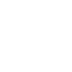

# Graphical Alphabet

A collection of image operations, implemented as an exercises in 2d graphics.

**Inspired by**:

- http://ssp.impulsetrain.com/porterduff.html
- http://507movements.com/

### Porter/Duff composition

|                               &nbsp;                                |                                     &nbsp;                                      |                                     &nbsp;                                      |                                 &nbsp;                                  |                                   &nbsp;                                    |
| :-----------------------------------------------------------------: | :-----------------------------------------------------------------------------: | :-----------------------------------------------------------------------------: | :---------------------------------------------------------------------: | :-------------------------------------------------------------------------: |
|      [Src](examples/Src.png)     |          [Atop](examples/Atop.png)         |          [Over](examples/Over.png)         |          [In](examples/In.png)         |          [Out](examples/Out.png)         |
|    [Dest](examples/Dest.png)   |  [DestAtop](examples/DestAtop.png) |  [DestOver](examples/DestOver.png) |  [DestIn](examples/DestIn.png) |  [DestOut](examples/DestOut.png) |
|  [Clear](examples/Clear.png) |            [Xor](examples/Xor.png)           |    [Lighter](examples/Lighter.png)   |

### Transformation

|                                                 &nbsp;                                                  |                                             &nbsp;                                              |                                               &nbsp;                                                |                                               &nbsp;                                                |
| :-----------------------------------------------------------------------------------------------------: | :---------------------------------------------------------------------------------------------: | :-------------------------------------------------------------------------------------------------: | :-------------------------------------------------------------------------------------------------: |
|                  [Normal](examples/Normal.png)                 |  [RotateDest90](examples/RotateDest90.png) |  [RotateDest180](examples/RotateDest180.png) |  [RotateDest270](examples/RotateDest270.png) |
|                  [Normal](examples/Normal.png)                 |          [Rotate90](examples/Rotate90.png)         |          [Rotate180](examples/Rotate180.png)         |          [Rotate270](examples/Rotate270.png)         |
|  [FlipHorizontal](examples/FlipHorizontal.png) |  [FlipVertical](examples/FlipVertical.png) |

### Resize

|                                             &nbsp;                                              |                                 &nbsp;                                  |                                               &nbsp;                                                |                                                           &nbsp;                                                            |
| :---------------------------------------------------------------------------------------------: | :---------------------------------------------------------------------: | :-------------------------------------------------------------------------------------------------: | :-------------------------------------------------------------------------------------------------------------------------: |
|              [Normal](examples/Normal.png)             |  [Resize](examples/Resize.png) |  [ResizeInPlace](examples/ResizeInPlace.png) |                [ResizeOffset](examples/ResizeOffset.png)               |
|  [ResizeLarger](examples/ResizeLarger.png) |  [Padded](examples/Padded.png) |  [PaddedResized](examples/PaddedResized.png) |  [ResizeLargerCorrect](examples/ResizeLargerCorrect.png) |

## Plan

- **Porter/Duff composition**

  - [x] Source
  - [x] Atop
  - [x] Over
  - [x] In
  - [x] Out
  - [x] Dest
  - [x] DestAtop
  - [x] DestOver
  - [x] DestIn
  - [x] DestOut
  - [x] Clear
  - [x] Xor
  - [x] Bonus: Lighter

- **Transformation**

  - [x] Flip horizontally/vertically
  - [x] Rotate
  - [x] Resized

- **Effects**
  - [ ] Blur
  - [ ] Pixelate
